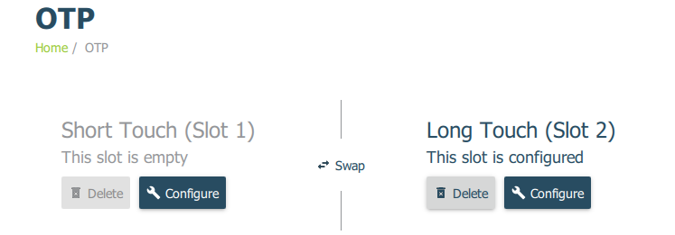
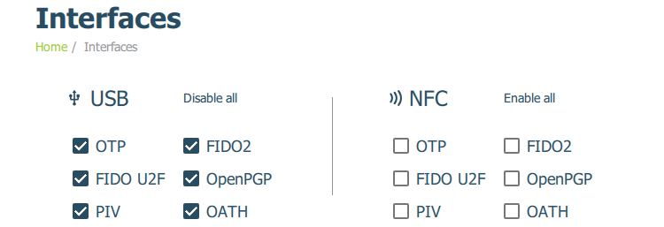

Ubuntu GPG Yubikey Config for SSH
---------------------------------
Configure yubikey for SSH authentication on Ubuntu. Assumes [Yubikey has GPG
Subkeys pre-loaded][1].

1. [Creating GPG Keys][1]
1. [Export GPG Subkeys to Yubikey][2]
1. [Windows GPG Yubikey Setup][3]
1. [Ubuntu GPG Yubikey Setup][4]

Gnome-keyring implements both ssh-agent and gpg-agent with a [broken
implementation][5] that does not support smart cards. This will be disabled.

Required Materials
------------------
1. Pre-configured Yubikey.

### Install GPG On Machine
This will provide GPG interactions as well as an agent to provide key material.

```cmd
apt update && apt upgrade
apt-add-repository ppa:yubico/stable
apt update
apt install software-properties-common yubikey-manager yubikey-manager-qt scdaemon gnupg2 pcscd
apt remove libpam-gnome-keyring
```
* Ubuntu **18.04+** needs to add `universe multiverse` to all apt sources first
  `/etc/apt/sources.list`.

Configure Yubikey
-----------------
Configure behavior of Yubikey so short touches will provide GPG material, while
long touches will provide Yubico OTP. This prevents accidental touches spewing
keystrokes into whatever is open. NFC is also disable.

1. Open Yubikey Manager
1. Select `Applications > OTP`
1. Delete `Slot 1`
1. Configure `Slot 2` to use `Yubico OTP`
* Alternatively, newer keys can just use the swap button.

Results should look like this:


If your key has NFC support, this can be disabled as well.

1. Open Yubikey Manager
1. Select `Interfaces`
1. Uncheck **all** NFC options
1. Click `Save Interfaces`

Results should look like this:


Configure GPG Agent
-------------------
### Import & Ultimate Trust Your Certificate
This will set ultimate trust for the [GPG public][7] certificate you created
when making your GPG key.

```bash
gpg --import YOUR_PUBLIC_GPG_KEY.asc
gpg --list-key
gpg --edit-key $KEYID
trust
5
save
gpg --list-secret-keys
```
* `gpg --card-edit; fetch` will pull the GPG public key from the [URL
  provided][8] on the yubikey. This is better if you are using from multiple or
  new machines.
* KEYID is listed from `--list-key`
* `--list-secret-keys` should show `#` for private cert not on machine, and `>`
  for your signing, authentication and encryption certs on the Yubikey.

### Setup GPG Agent for SSH
This will enable SSH usage with the gpg-agent.

./gnupg/gpg-agent.conf
```
enable-ssh-support
```

### Export Environment Variables on Login
Setup the GPG environment when logging in with user.

~/.gpg-yubikey
```bash
if [ ! -f "${HOME}/.gpg-agent-info" ] && [ -S "${HOME}/.gnupg/S.gpg-agent" ] && [ -S "${HOME}/.gnupg/S.gpg-agent.ssh" ]; then
echo "GPG_AGENT_INFO=${HOME}/.gnupg/S.gpg-agent" >> "${HOME}/.gpg-agent-info";
echo "SSH_AUTH_SOCK=${HOME}/.gnupg/S.gpg-agent.ssh" >> "${HOME}/.gpg-agent-info";
fi

if [ -f "${HOME}/.gpg-agent-info" ]; then
. "${HOME}/.gpg-agent-info"
export GPG_AGENT_INFO
export SSH_AUTH_SOCK
export GPG_TTY=$(tty)
gpg-connect-agent updatestartuptty /bye >& /dev/null
fi
```

~/.bash_profile
```bash
. ~/.gpg-yubikey
```

~/.bashrc
```bash
. ~/.gpg-yubikey
```


### Allow Users to Automount Yubikeys

/etc/udev/rules.d/99-yubikeys.rules
```bash
ACTION=="add",SUBSYSTEM=="usb", ATTR{idVendor}=="1050", ATTR{idProduct}=="0404", OWNER="USERNAME"
```
* `username` should be your username.

### Disable Gnome SSH Fuckery

`Ubuntu > Settings > Session > Startup > Advanced` > Uncheck Launch gnome
services on startup
* May be listed as SSH agent

/etc/X11/Xsession.options
```bash
#use-ssh-agent
```
* Disable use-ssh-agent

**reboot**

SSH
---
Ensure yubikey is readable by GPG. This assumes you have setup your _exported
GPG ssh key_ on the server you are connecting to already (e.g.
~/.ssh/authorized_keys).

```bash
gpg --card-status
```
* If the Yubikey does not appear, reinsert the key.

### Logging In

1. Connect with ssh as normal.
1. a `PinEntry` pop-up window should appear. It may not be in focus. Enter your
   **User PIN**. Click `OK`.

   
   * Number is the Yubikey serial number.
   * Holder is the First/Last name of the GPG certificate on the key.
   * Your key will blink when waiting for password or touch.

1. There _will be no prompt_. **Tap Your Key**. If successful you will login.

Errors & Problems
-----------------
### SSH connection failed, Server sent: publickey
Happens because of a standard publickey not provided / matched failure.

1. SSH public key is not loaded on the SSH server. Confirm your public SSH key
   (exported from GPG with `--export-ssh-key`) is added to `authorized_keys` for
   the user you are attempting to login with.
1. GPG agent configuration is not reloaded. Ensure ssh and putty support in
   configuration is set and `gpg-agent` and `gpg-connect-agent` are both
   restarted.

### Please insert card with serial number


Occurs because the original key used for authentication is not the key being
used now. [GPG Agent caches the serial number][6] of the card for the KeyStub
used. This just needs to be removed.

1. Show all keygrips in GPG, these will be used to match cache in private store.
   ```bash
   gpg --with-keygrip --list-keys
   ```
1. Identify keygrip in `~/.gnupg/private-keys-v1.d/` and delete it, or
   you can just remove all keys in that directory.

[1]: README.md
[2]: yubikey.md
[3]: windows.md
[4]: ubuntu.md
[5]: https://www.forgesi.net/gpg-smartcard/
[6]: https://security.stackexchange.com/questions/165286/how-to-use-multiple-smart-cards-with-gnupg
[7]: https://stackoverflow.com/questions/31784368/how-to-give-highest-trust-level-to-an-openpgp-certificate-in-kleopatra
[8]: https://withinboredom.info/2017/11/18/signing-commits-ssh-with-yubikey-and-windows/

[ref1]: https://occamy.chemistry.jhu.edu/references/pubsoft/YubikeySSH/index.php
